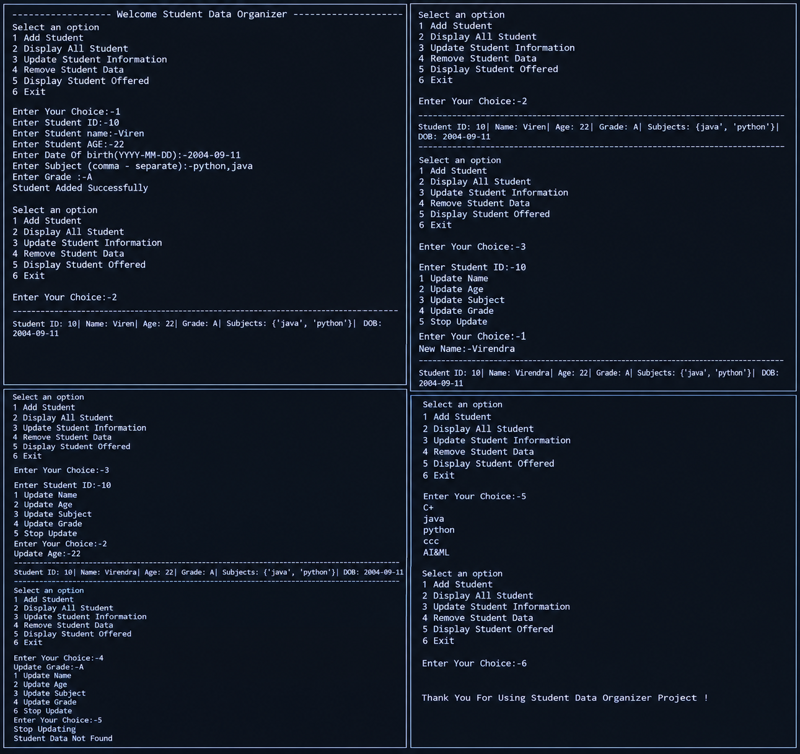

````markdown
# Student Data Organizer

## Project Description

Student Data Organizer is a Python-based console application designed to manage student information easily. The project allows users to add student records, display all student information, update existing student details, remove student data, and display all unique subjects offered by students. This project is created for learning and practicing Python programming concepts and basic CRUD operations.

## Difficulty Level

**Beginner to Intermediate**

## Features

- Add Student
- Display All Students
- Update Student Information
- Remove Student Data
- Display Student Offered Subjects
- Exit the Program
- Store Student ID, Name, Age, Date of Birth, Subjects, and Grade
- Update Name, Age, Subject, and Grade
- Display unique subjects using Python Sets

## Technologies Used

- Python 3
- Python Standard Library
- Command Line / Terminal

No external libraries are required.

## How to Run

First, make sure Python 3 is installed on your computer.

Check Python installation:

```bash
python --version
````

Then open the project folder in Command Prompt, PowerShell, or Terminal and run:

```bash
python student_data_organizer.py
```

If your system uses `python3`, run:

```bash
python3 student_data_organizer.py
```

## Installation

No additional packages are required. Simply install Python 3.x and run the Python file.

You can also clone the project from GitHub:

```bash
git clone <your-repository-url>
cd student-data-organizer
python student_data_organizer.py
```

## Project Structure

```text
student-data-organizer/
│
├── student_data_organizer.py
├── README.md
└── .gitignore
```

### File Description

| File                        | Description                                               |
| --------------------------- | --------------------------------------------------------- |
| `student_data_organizer.py` | Main Python program containing the Student Data Organizer |
| `README.md`                 | Project documentation                                     |
| `.gitignore`                | Files and folders ignored by Git                          |

## Program Menu

```text
Select an option

1 Add Student
2 Display All Student
3 Update Student Information
4 Remove Student Data
5 Display Student Offered
6 Exit
```

## Student Information

The application stores the following information:

* Student ID
* Student Name
* Age
* Date of Birth
* Subjects
* Grade

## Data Storage

Currently, student information is stored temporarily in memory using a Python list:

```python
students = []
```

The data will be lost when the program is closed.

In the future, permanent storage can be added using:

* JSON
* CSV
* SQLite
* MySQL

## Python Concepts Used

This project demonstrates several important Python concepts:

* Variables
* Data Types
* Lists
* Dictionaries
* Tuples
* Sets
* `if-elif-else`
* `for` loops
* `while` loops
* User Input
* String Operations
* CRUD Operations
* Nested Loops
* Conditional Statements

## Future Improvements

The project can be improved by adding:

* Input validation
* Duplicate Student ID checking
* Better error handling
* Student search functionality
* Sorting students by name, age, or grade
* Permanent data storage
* Database connectivity
* Graphical User Interface (GUI)
* Object-Oriented Programming
* Login and authentication system
# output




## Author

**Virendra Nakum**

 
